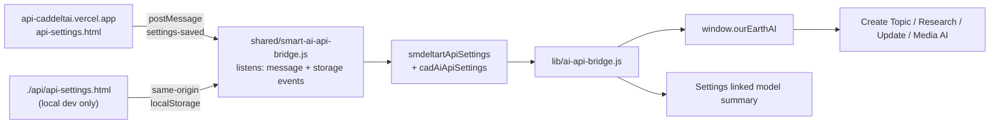

# AI API Bridge Strategy

## Decision

Use a shared collection-level bridge for provider/model routing, with a thin project adapter in each app.

For topic.earth that means:

- `shared/smart-ai-api-bridge.js` is the reusable bridge for SmDeltArt collection apps.
- `lib/ai-api-bridge.js` is only the topic.earth adapter that installs the shared bridge and persists the linked provider/model summary into topic.earth settings.
- Feature code calls `window.ourEarthAI`, not Websim-specific globals.
- `api-settings.html` stays the settings UI and can later be hosted as a stable widget URL.

This gives us one shared place to update evolving provider/model support while still allowing each app to keep its own settings, labels, permissions, and fallback behavior.

## Why Not Project-Only

Keeping all API routing inside `lib/ai-api-bridge.js` would make topic.earth work, but it would duplicate the same provider/model work in the collection portal, widgets, and future apps.

Provider menus and model IDs will change often. If every app owns its own bridge, each provider change becomes a multi-app update. That is slow and easy to break.

The project should only own:

- App-specific setting defaults.
- Whether linked AI is allowed for web search and updates.
- What status summary appears in Settings.
- Fallback policy for the current app.

The shared bridge should own:

- Reading `api-settings.html` storage keys.
- Mapping selected providers to request endpoints.
- Choosing the correct model for the selected provider.
- Exposing neutral methods like `createChatCompletion`, `generateImage`, and `uploadLocalFile`.

## Hosting Path

Short term:

- Keep `api-settings.html` bundled locally in topic.earth.
- Open it in the 430 x 600 in-app iframe overlay.
- Read/write settings from the same browser local storage.

Medium term: ✅ **DONE (2026-06-02)**

- ~~Host the API settings UI as a SmDeltArt widget URL.~~  
  **Deployed at `https://api-caddeltai.vercel.app/api-settings.html`** — centralized for ALL apps.
- ~~Point `aiApiSettingsFrameUrl` to that hosted URL.~~  
  **Env-aware URL pattern used in `index.html`:**
  ```js
  var API_SETTINGS_URL = isLocal
    ? "./api/api-settings.html?embed=true" // local dev — same-origin
    : "https://api-caddeltai.vercel.app/api-settings.html?embed=true"; // prod
  ```
- ~~Import settings sent by the widget through postMessage into the parent app cache.~~  
  **`smart-ai-api-bridge.js` already handles `settings-saved` postMessages and syncs to `smdeltartApiSettings` / `cadAiApiSettings`.**
- `WIDGET_ALLOWED_PROD_ORIGINS` now includes `https://api-caddeltai.vercel.app`; Vercel pattern updated to match `api-caddeltai*` deployments.
- **CSP on `api-caddeltai.vercel.app`**: `frame-ancestors` allows `https://*.topic.earth https://*.smdeltart.com https://*.caddeltai.com https://*.vercel.app http://localhost:*`.
- Local dev: `./api/api-settings.html` is a copy synced from `private/api/` in `__actual_vs`.

Long term:

- Split provider/model definitions into a shared manifest file consumed by both `api-settings.html` and `shared/smart-ai-api-bridge.js`.
- Version the manifest so old deployed apps can keep working while new provider lists evolve.
- Keep postMessage-based sync as the canonical cross-origin path, because browser localStorage is separated by domain.

## No Websim Rule For This Step

Websim should not be an active runtime dependency for this pipeline now.

Allowed:

- Legacy labels or migration notes that mention Websim.
- Import/export compatibility if older saved data contains Websim-era fields.

Not allowed:

- New feature code calling `window.websim`.
- New API settings paths that require Websim hosting.
- Recording or topic update flows that depend on Websim project quota.

## Current Runtime Shape (2026-06-02)



**localStorage key chain (read order):** `smdeltartPreferences` → `smdeltartApiSettings` → `cadAiApiSettings` → `smart_api_settings`

## Next Smart Move

The next cleanup should be to create one provider manifest, for example `shared/ai-provider-manifest.js` or `shared/ai-provider-manifest.json`, then make both the settings widget and the bridge read from it.

That prevents the current "provider list in one file, request router in another file" drift.

The bridge added now is a good transition step: it removes active Websim coupling and centralizes AI calls without forcing a full settings-widget rewrite immediately.
