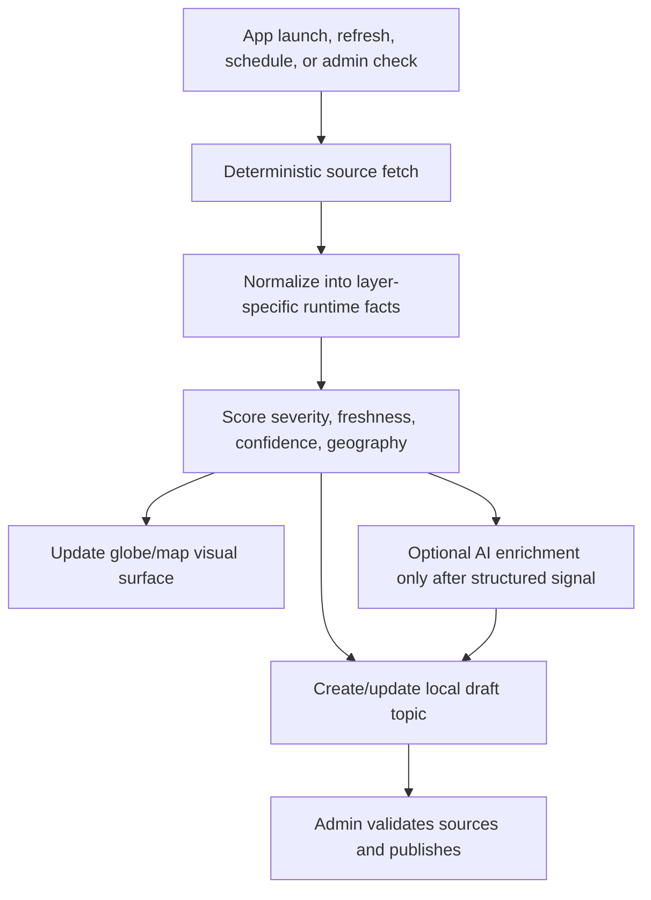

# Online Layer Auto-Update Strategy

Date: 2026-06-01  
Workspace: `C:\Users\bedes\OneDrive\SmDeltArt_Collection\__actual_vs\topic.earth`

## Goal

Use the same logic as the live meteo/cloud work for other layers:

1. deterministic online signal first;
2. visual runtime layer second;
3. reviewed topic draft third;
4. AI only for enrichment, source discovery, translation, and summary when structured evidence already exists.

This avoids two problems:

- static topics pretending to be current;
- AI-generated claims being displayed as facts before source validation.

Related detailed plan: [COP, Ozone, Atmosphere And Satellite Layer Plan](cop_ozone_atmosphere_layer_plan.md) covers yearly COP summaries, ozone-hole visualisation, atmosphere composition, and Earth-observation satellite links.

## Core Pattern



Every auto-updated layer should expose:

- `sourceUrl`
- `sourceName`
- `sourceType`: `official`, `scientific`, `database`, `news`, `community`, `model`
- `updatedAt`
- `validFrom` / `validTo` when available
- `confidence`: `measured`, `official-warning`, `model-signal`, `peer-reviewed`, `needs-review`
- `reviewState`: `runtime`, `draft`, `source-confirmed`, `published`
- `geoScope`: `world`, `continent`, `country`, `region`, `local`

## Climate Change Runtime Layer

Climate Change should not behave like meteo. Meteo is hours/days. Climate is monthly, seasonal, annual, and multi-year trend.

Best structure:

- `climate-indicators-live`: measured global/regional indicators;
- `climate-studies-watch`: latest high-quality scientific/publication updates;
- `climate-extreme-attribution`: bridges extreme events to attribution science when evidence exists.

### Measured Indicators

Use central measured or reanalysis sources:

- Copernicus Climate Indicators for global temperature, sea level, greenhouse gases, cryosphere and related datasets.
- WMO State of the Global Climate for authoritative yearly and COP updates on greenhouse gases, temperature, sea level, ocean heat/acidification, sea ice, glaciers, impacts, and extremes.
- NOAA NCEI / Climate Data Online for climate archives and U.S./global datasets.
- NASA POWER Climate Indicators API for coordinate-based climate indicator requests.
- NASA GISTEMP or NOAA global temperature anomaly products for long-term temperature anomaly display.

Runtime display idea:

- color the Climate Change globe layer by indicator anomaly:
  - blue/neutral: normal baseline or no current anomaly;
  - yellow: notable anomaly;
  - orange: high anomaly;
  - red: record/near-record signal.
- keep the topic draft separate from the visual signal:
  - visual surface = latest measured indicator;
  - topic = reviewed explanation with source links.

Topic draft fields:

- title: `Global temperature anomaly update`, `Sea level indicator update`, `Greenhouse gas concentration update`
- layer: `climate-change`
- region: global/continent/country if source supports it
- summary: measured value + baseline + period
- evidence: official/scientific source URL
- analysis: what changed since previous snapshot

## Extreme Meteo And Attribution

Extreme events are two different things:

1. live hazard signal: storm, flood, heat, freeze, wind, hurricane, ENSO impact;
2. climate attribution evidence: whether climate change made the event more likely/intense.

The app should not automatically claim attribution from a live event alone.

Recommended statuses:

- `live-hazard`: Open-Meteo / national warning / GDACS says something is happening;
- `official-confirmed`: national warning or official alert confirms it;
- `attribution-candidate`: event is significant enough to check attribution sources;
- `attribution-supported`: Climate Central, World Weather Attribution, Climate Attribution database, peer-reviewed study, or official report supports a climate link;
- `attribution-not-found`: no reliable attribution source found yet.

Useful sources:

- Climate Central Attribution Science and Climate Shift Index for real-time temperature and ocean attribution signals.
- World Weather Attribution for rapid event attribution reports.
- Climate Attribution database for legal/scientific attribution resources.
- Carbon Brief attribution map for published attribution studies and event mapping.
- NOAA CPC for ENSO / El Nino / La Nina monitoring and outlooks.
- GDACS for global disaster alerts around floods, tropical cyclones, and major hazards.

Super El Nino / ENSO handling:

- create a separate `enso-watch` runtime topic, not a random meteo point;
- source NOAA CPC / WMO / Copernicus ocean-state updates;
- connect it to global/regional meteo risk only when sources explain teleconnection risk;
- show it as a world-scale climate driver, not a local warning.

## Good Initiatives, Sustainable News, And Conferences

Good initiatives are not "live hazard" data. They are curated, slower-moving, and need stronger source classification.

Layer candidates:

- `good-initiatives-world`
- `good-initiatives-eu`
- `country-good-initiatives`
- `community-projects` remains regional only

Useful source directions:

- CoAct Database for voluntary climate action initiatives linked to SDGs and global stocktake priorities.
- UN SDG Good Practices database/material for sustainable development examples.
- WIPO GREEN for environmental/climate solution and innovation matching.
- Earth Negotiations Bulletin for structured coverage of environmental and sustainable-development negotiations and conferences.
- EU / national government portals for funding calls, climate law, circular economy, biodiversity, energy transition, transport, and adaptation programs.

Scoring:

- `official-program`: government/UN/EU program or funding decision;
- `verified-initiative`: known database entry or institutional report;
- `conference-update`: COP, UN, EU, city/network summit, treaty negotiation;
- `local-community`: needs local/admin validation;
- `news-only`: visible but needs stronger source before becoming a highlighted topic.

Avoid:

- generic "good news" scraping as if it were verified impact;
- publishing corporate claims without independent/official evidence;
- mixing regional community projects into World mode.

## Layer Auto-Adaptability Matrix

| Layer type | Refresh rhythm | Source type | AI role | Publish rule |
| --- | --- | --- | --- | --- |
| Live meteo | launch + 15 min cache | model + official warnings | summarize and find confirmations | runtime visible, publish after review |
| Climate indicators | monthly/annual, plus app launch cache | official/scientific datasets | explain change and compare baselines | publish measured values with source |
| Extreme attribution | event-triggered + weekly scan | attribution orgs, peer-reviewed, official reports | match event to studies and summarize | no attribution claim without source |
| ENSO/global drivers | weekly/monthly | NOAA/WMO/Copernicus | explain risk pathways | publish as driver/watch, not local warning |
| Good initiatives | weekly/monthly | databases, official programs, conference reports | classify and summarize | needs source classification |
| Regional/community | user location + admin action | local official/community links | draft and translate | local review required |

## Better Online Check Architecture

Add one service per source family instead of one generic "AI search" button:

- `MeteoWatchService`
- `ClimateIndicatorService`
- `AttributionWatchService`
- `InitiativesWatchService`
- `ConferenceWatchService`

Each service returns the same normalized object:

```json
{
  "id": "climate-global-temperature-2026-06",
  "layerId": "climate-change",
  "title": "Global temperature anomaly update",
  "summary": "Measured indicator changed for the latest reporting period.",
  "sourceUrl": "https://...",
  "sourceName": "Copernicus Climate Change Service",
  "sourceType": "scientific",
  "updatedAt": "2026-06-01T00:00:00Z",
  "geoScope": "world",
  "lat": 0,
  "lon": 0,
  "severity": "notable",
  "confidence": "measured",
  "reviewState": "runtime",
  "needsAiEnrichment": true
}
```

Then each layer decides how to render it:

- globe marker;
- cloud/heat/indicator surface;
- right-panel topic draft;
- source-confirmation shortcut.

## Practical Next Coding Steps

1. Create a generic `OnlineLayerSignal` shape shared by meteo, climate, attribution, and initiatives.
2. Keep `meteo-live` as the first working implementation.
3. Add `climate-indicators-live` as a second implementation using one no-key or file-backed official dataset first.
4. Add visual climate indicator surfaces:
   - temperature anomaly;
   - ocean/sea-level indicator;
   - ice/cryosphere signal.
5. Add an attribution checker triggered from severe meteo topics:
   - "Check attribution sources";
   - "Check ENSO/global driver";
   - "Check official warning".
6. Add initiative source folders and review states before displaying "good initiative" items as high-confidence.

## Important Rule

Meteo can be live. Climate can be current. Attribution must be sourced. Good initiatives must be classified.

That should be the rule baked into the UI and topic draft pipeline.

## Implementation Note, 2026-06-01 Climate Indicators

The first non-meteo implementation is now wired:

- `lib/online-layer-signals.js` defines the generic runtime signal shape, severity color, priority, freshness and review metadata.
- `lib/climate-indicators.js` fetches measured climate indicators where possible:
  - NASA GISTEMP global land-ocean temperature anomaly;
  - NOAA GML Mauna Loa monthly CO2.
- If those online sources fail, the service returns source-registry runtime topics for Copernicus Climate Indicators and WMO State of the Climate, marked as `needs-review`.
- The `climate` layer receives these runtime points at launch and when the Climate Change layer is toggled on.
- The layer list displays `checked`, confidence and review state so these read as current runtime checks, not static published claims.

Next coding target:

1. Add an "Check attribution sources" action for severe `meteo-live` events.
2. Add a small `enso-watch` service from NOAA/WMO/Copernicus sources.
3. Add an `InitiativesWatchService` with source classification before any good-initiative item appears as high confidence.

## Implementation Note, 2026-06-01 Good Initiatives Watch

Good initiatives now have a first runtime watch path across three scopes:

- `good-initiatives-world`: global source-watch signals such as CoAct and UN SDG good practices.
- `good-initiatives-eu`: EU climate action, missions, city/regional transition and funding/program sources.
- `community-projects`: regional/local hopeful actions near the current Regional focus, kept as source-search/draft until a direct organizer/official/database source is attached.

This is intentionally not a generic "good news" scraper. It is a hope/action lane with evidence rules:

- show action possibilities to avoid climate-news despair;
- classify source quality before publication;
- keep local/regional initiatives reviewable and joinable;
- use AI to summarize and translate, not to invent impact.

The app should balance:

- danger signals: meteo, extreme events, climate indicators;
- agency signals: initiatives, repair/reuse, energy communities, adaptation, mobility, water, biodiversity, COP implementation.
