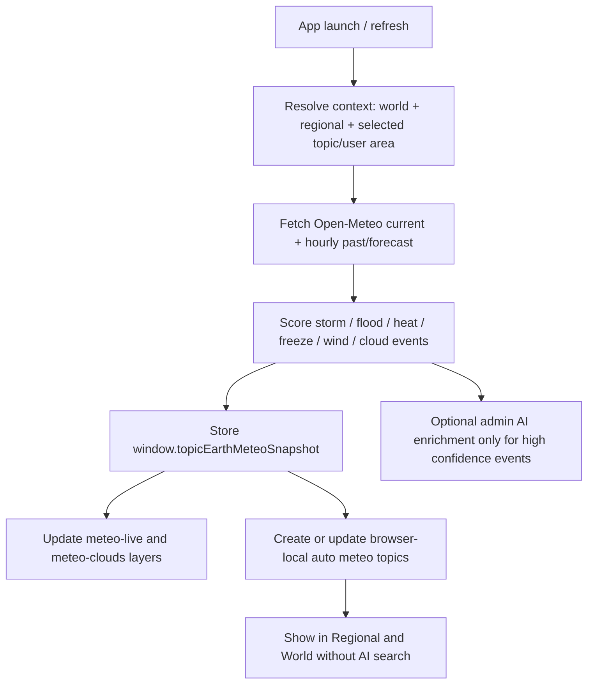

# Online Meteo Auto-Update Brainstorm

Date: 2026-05-30  
Workspace: `C:\Users\bedes\OneDrive\SmDeltArt_Collection\__actual_vs\topic.earth`

## Trigger

During the night of 2026-05-29 to the morning of 2026-05-30, strong thunderstorms (`orage`) happened around the user in western Europe, but topic.earth did not automatically surface a local meteo update. The app has an existing live meteo layer, yet it currently samples a small fixed world list and does not create local event topics from recent/forecast severe conditions.

Related broader roadmap: [Online Layer Auto-Update Strategy](online_layer_auto_update_strategy.md) extends this runtime-source-review pattern to Climate Change, extreme attribution, ENSO/global drivers, and good initiatives.

## Existing App State

Current files:

- `lib/meteo-realtime.js`
- `app.main.js`
- `data/layers.js`
- `components/RegionalMap.js`

Current behavior:

- Uses Open-Meteo `/v1/forecast`.
- Requests current variables only for a fixed `SAMPLE_LOCATIONS` list.
- Creates `meteo-live` points and cloud samples.
- Refreshes if meteo/cloud layers are active and cache is older than about 15 minutes.
- Displays regional map overlays from the same meteo point list.

Current limitation:

- It does not ask: “What is happening near the user or current regional map?”
- It does not request recent hourly history, 15-minute thunderstorm variables, CAPE, gusts, precipitation probability, or freezing level.
- It does not create/update “auto meteo event topics”.
- It does not consume official weather alerts such as MeteoAlarm / Météo-France Vigilance / NWS alerts.

## Source Options

### 1. Open-Meteo Forecast API

Best first move for no-key realtime/forecast model data.

Open-Meteo supports coordinates, multiple coordinates in one request, current variables, hourly variables, daily variables, timezone auto, and recent/forecast windows. Its docs state `/v1/forecast` accepts WGS84 coordinates and can return JSON hourly forecasts; current values are returned as numeric fields. It also exposes weather code, precipitation, showers, rain, wind gusts, CAPE, freezing level, and 15-minute variables including lightning potential where available.

Use it for:

- launch refresh;
- current world samples;
- current regional focus;
- recent night/morning check with `past_hours`;
- near-future storm/heat/freeze risk with `forecast_hours`;
- “possible event” scoring.

Useful variables:

- `current`: `temperature_2m`, `relative_humidity_2m`, `precipitation`, `rain`, `showers`, `cloud_cover`, `wind_speed_10m`, `wind_gusts_10m`, `wind_direction_10m`, `weather_code`
- `hourly`: `temperature_2m`, `precipitation`, `rain`, `showers`, `precipitation_probability`, `weather_code`, `cloud_cover`, `wind_speed_10m`, `wind_gusts_10m`, `cape`, `freezing_level_height`
- `minutely_15` where useful: `precipitation`, `rain`, `showers`, `lightning_potential`, `cape`, `wind_speed_10m`

Source: [Open-Meteo API documentation](https://open-meteo.com/en/docs)

### 2. MeteoAlarm / MeteoGate For Europe

Best official European warning source, but direct API access may require token/registration depending on endpoint.

MeteoAlarm provides weather warnings from EUMETNET members through an OGC API EDR interface and metadata APIs. Their portal says the general public should use MeteoGate, while organizations/re-users can request API access. It also notes warnings are provided by EUMETNET members and uses CAP/hazard warning concepts.

Use it for:

- official alert layer over Europe;
- hazard type, level/color, validity period, affected area;
- source attribution.

Do not block the first implementation on it. Treat it as phase 2 after the Open-Meteo no-key detector works.

Source: [MeteoAlarm API Portal](https://api.meteoalarm.org/edr/v1?f=html)

### 3. National Meteorological Services

Useful for official warning confidence, especially:

- Météo-France Vigilance for France;
- national meteo services for Belgium, Netherlands, Germany, etc.;
- NWS API for the United States.

Météo-France explains that Vigilance is permanently available on its site/apps and signals dangerous meteorological phenomena for departments in the next 48 hours. NWS provides public CAP alert endpoints for watches/warnings/advisories and recommends not requesting alerts more often than every 30 seconds.

Use them as official confirmation, not as the only global source.

Sources:

- [Météo-France Vigilance explanation](https://meteofrance.com/education/comprendre-la-vigilance-meteorologique)
- [NWS Alerts Web Service](https://www.weather.gov/documentation/services-web-alerts)

### 4. AI Search / Harder Extreme Event Discovery

Use AI only after deterministic meteo data has raised a signal.

Good AI role:

- explain the event in plain language;
- classify whether “storm”, “flooding”, “exceptional heat”, “freeze/unfreeze”, “record temperature” are plausible;
- search official/local sources for confirmation if user explicitly asks or admin mode schedules it;
- draft a topic from already-gathered structured data.

Bad AI role:

- constantly search the web on every app launch;
- decide alerts without structured meteo data;
- make claims like “record temperature” without official record source.

## Best Move

Build a deterministic `MeteoWatchService` first.

It should run on app launch/refresh and build three snapshots:

1. `worldWatch`: existing world sample locations plus a better global grid or curated high-risk anchor points.
2. `regionalWatch`: current regional map center, user location if allowed, selected topic coordinates, and nearby offset points.
3. `extremeWatch`: derived event candidates scored from recent and forecast values.

No AI needed for phase 1.

## Proposed Runtime Flow



## Event Scoring Rules

Initial heuristics:

- **Thunderstorm / Orage candidate**
  - weather codes in thunderstorm range when available;
  - high `showers` or sudden precipitation spike;
  - high `cape`;
  - high `lightning_potential` where available;
  - gusts above local threshold.

- **Flood / heavy rain candidate**
  - recent precipitation accumulation over 3h/6h/24h;
  - forecast precipitation spike;
  - repeated heavy rain codes;
  - optional later: river/flood warning source.

- **Exceptional heat candidate**
  - high current/forecast temperature relative to local recent average or seasonal normal;
  - heatwave duration threshold;
  - humidity/heat-index later.

- **Freeze / unfreezing candidate**
  - temperature crossing 0 C;
  - freezing level height rising/falling quickly;
  - rain with near-freezing temperatures.

- **Wind/storm candidate**
  - gust thresholds;
  - fast wind changes;
  - official warning confirmation if available.

Each event candidate should carry:

```json
{
  "id": "meteo-auto-storm-2026-05-30-liege-west",
  "category": "meteo-live",
  "eventType": "storm",
  "confidence": "model-signal|official-alert|confirmed-source",
  "severity": "watch|notable|warning|severe",
  "lat": 50.55,
  "lon": 5.33,
  "title": "Possible thunderstorm window near Liège",
  "summary": "Open-Meteo model data shows recent/forecast storm indicators...",
  "source": "Open-Meteo forecast model",
  "sourceUrl": "https://open-meteo.com/en/docs",
  "meteo": {
    "fetchedAt": "2026-05-30T...",
    "window": "past 12h + next 24h",
    "precipitationMaxMmH": 0,
    "windGustMaxKmh": 0,
    "capeMax": 0,
    "weatherCodes": []
  },
  "storageMeta": {
    "workflow": "auto-meteo",
    "autoUpdated": true,
    "expiresAt": "..."
  }
}
```

## UI Behavior

World mode:

- Keep global cloud shell.
- Show curated world meteo anchors.
- Add only significant `extremeWatch` candidates, to avoid noise.

Regional mode:

- Always fetch regional meteo around the current regional focus.
- Show local event cards even when they are not “global news”.
- Add an “Updated just now / model fallback / official alert” status.

Topic detail:

- For auto meteo topics, show:
  - source model;
  - fetched time;
  - warning that this is not an official emergency alert;
  - key variables;
  - official-alert confirmation if present.

## Implementation Phases

### Phase 1: No-Key Auto Meteo

- Refactor `lib/meteo-realtime.js` into:
  - `fetchOpenMeteoForLocations(locations, options)`;
  - `buildMeteoWatchLocations(appContext)`;
  - `scoreMeteoEvents(snapshot)`;
  - `makeMeteoAutoTopics(events)`.
- On app launch, refresh if meteo layers enabled or regional mode active.
- Add regional focus location to the request.
- Request current + hourly `past_hours=12` and `forecast_hours=36`.
- Create/update browser-local auto topics with stable IDs.

### Phase 2: Europe Official Alerts

- Add MeteoAlarm/MeteoGate connector when API access is clear.
- For France, optionally add Météo-France Vigilance links/status as source attribution.
- Merge official alert candidates into the same auto-topic model.

### Phase 3: AI-Assisted Event Enrichment

- If a candidate reaches `warning` or `severe`, allow admin action:
  - “Explain event”;
  - “Find official/local confirmation”;
  - “Draft meteo topic”.
- AI output must cite structured meteo values and source URLs.
- AI must not claim records unless official data/source says record.

## Guardrails

- Never present model output as official emergency warning.
- Always show source, fetch time, and confidence.
- Respect public API rate limits.
- Cache launch fetches for 10-15 minutes.
- Avoid browser-only massive grids; use a small regional grid and curated world anchors.
- Keep auto topics ephemeral unless user/admin saves them.

## Open Questions

- Should local/regional focus use browser geolocation, selected topic location, map center, or a manually saved home region first?
- Should auto meteo topics be saved in localStorage, session-only, or a separate `autoPoints` cache?
- Which Europe official alert path is easiest for public use: MeteoGate, MeteoAlarm token, national services, or a small server-side proxy later?
- Should “record temperature” be disabled until a reliable climate-record source is wired in?

## Recommendation

Start with Open-Meteo regional auto-watch on launch.

It is the best balance of useful, no-key, browser-safe, and deterministic. It will catch many “orage / heavy rain / gust / heat / freeze” situations without waiting for AI search. Then add official alerts as confidence overlays, and finally use AI only for summarizing and confirmation search.

## Implementation Note, 2026-05-30

Phase 1 is started in code:

- `lib/meteo-realtime.js` now builds world + regional/user-focus watch locations.
- Open-Meteo requests include current data plus recent/forecast hourly windows.
- The snapshot returns `livePoints`, `eventPoints`, and combined meteo `points`.
- Event scoring creates model-signal auto topics for storm/orage, heavy rain/flood watch, heat anomaly, freeze/thaw, and wind.
- `app.main.js` refreshes meteo on app launch and when regional context changes.
- Auto event topics are ephemeral runtime points, not saved published topics.

This is especially useful for the planned Gardening layer:

- watering windows after rain;
- protect plants before wind/storm;
- frost/freeze-thaw caution;
- heat stress and shade/mulch timing;
- rain-garden and flood-stress observation after heavy precipitation.

The implementation still needs official alert confirmation as Phase 2. Until then, these topics must remain labeled as Open-Meteo model guidance, not official emergency alerts.

## Implementation Note, 2026-05-31

The next slice makes the runtime warning actionable without treating it as validated publication:

- Regional meteo digest `Topic` now opens a prefilled browser-local topic draft from the primary live warning/focus signal.
- The draft includes title, `meteo-live` layer, date, region/country, lat/lon, summary, source note, Open-Meteo evidence link, and a structured meteo snapshot in the analysis field.
- Saving remains browser-local first (`browser-localStorage`) with a meteo workflow marker. Admin/export review is still the validation path before any published repo data.
- The raw `meteo` values, event type, severity, score, and confidence are preserved in saved custom-topic storage so later export/review can compare the draft against the original runtime snapshot.
- UI/tutorial copy for the digest action was added to `shared/topic-earth-ui.csv` with French first, so the tutorial and labels can move with the CSV workflow.

Next validation step: add official alert/source confirmation buttons for national meteo services, lightning maps, outage/degradation reports, and flood/heat records. AI should only enrich a warning after this deterministic meteo draft exists.

## World / Globe Warning Strategy

The globe should not try to show every ordinary weather sample. It should act as a global warning radar:

- `Clouds` stays visual: global/regional cloud and rain context, low-authority, mostly ambient.
- `Live Meteo` becomes the only clickable weather layer: sampled current conditions plus scored warning candidates.
- The old static `Meteo` layer and its built-in demo topic are removed from Regional and World to avoid duplicate meanings.
- World `Live Meteo` should be driven by a centralized runtime snapshot, not by many manually updated static topics.
- World mode should prioritize warning candidates by severity and regional focus:
  - severe storm/orage;
  - heavy rain or flood watch;
  - heat anomaly;
  - freeze/thaw;
  - wind gust risk.
- Add second-stage global hazards when a reliable source is available:
  - tropical cyclones / hurricanes / typhoons;
  - large floods;
  - extreme heat records;
  - strong winter storm / blizzard risk;
  - drought and exceptional El Nino / La Nina context.
- Globe markers should stay sparse. Show curated world anchors plus significant warning candidates only, not every current-condition point.
- Clicking a globe warning should open the same evidence-first detail/draft path as Regional: structured values, source, confidence, and an explicit "model guidance, not official alert" notice.
- Official confirmation should raise confidence, not replace the Open-Meteo snapshot: national meteo warning, lightning map, outage/degradation report, flood/river warning, heat-record source, or local authority/media report.

### World Runtime Routine

On app launch or refresh:

1. Load a centralized `worldMeteoWatch` runtime object.
2. Build watch locations:
   - curated world anchors, one or two per continent;
   - current user/regional focus;
   - last selected meteo topic area;
   - optional manually pinned watch areas.
3. Fetch deterministic weather model data first:
   - Open-Meteo `/v1/forecast` for current and hourly past/forecast windows;
   - keep the response in `window.topicEarthMeteoSnapshot`;
   - store `livePoints`, `eventPoints`, `cloudSamples`, `lastUpdated`.
4. Score events locally:
   - storm/orage: thunder WMO code, CAPE, showers, gusts;
   - flood/heavy rain: recent/forecast precipitation, rain intensity, probability;
   - heat: current/max temperature and anomaly against local model window;
   - freeze/thaw: near-freezing transitions;
   - wind: gust thresholds.
5. Merge official/disaster feeds when available:
   - MeteoAlarm / MeteoGate for Europe official warnings;
   - NOAA/NWS alerts for United States;
   - GDACS for major global floods, tropical cyclones, and multi-hazard disaster awareness;
   - national meteo services as country-specific confirmation.
6. Render only notable+ events on World:
   - `watch`: blue/cyan, small, not prominent;
   - `notable`: yellow;
   - `warning`: orange;
   - `severe`: red;
   - `confirmed`: add white/bright outline or badge.
7. Update date and state:
   - live meteo runtime topics should show the current fetch date/time, not stale static dates;
   - static published topics keep their original publication date;
   - runtime warnings get `updatedAt`, `validFrom`, `validTo` when source provides it.

### Centralized Runtime Topic Model

Prefer one runtime collection over editing many built-in topic files:

```js
{
  id: "world-meteo-watch",
  updatedAt: "2026-06-01T...",
  source: "open-meteo+official-feeds",
  userFocus: { lat, lon, label, precision },
  points: [
    {
      id: "meteo_auto_heavy-rain_2026-06-01_west-europe",
      category: "meteo-live",
      lat: 50.85,
      lon: 4.35,
      region: "Western Europe",
      country: "Belgium",
      continent: "Europe",
      eventType: "heavy-rain",
      severity: "warning",
      confidence: "model-signal|official-warning|local-confirmation",
      severityScore: 72,
      color: "orange",
      title: "Warning heavy rain / flood watch near Brussels",
      summary: "Model data indicates...",
      sourceUrl: "https://open-meteo.com/en/docs",
      confirmationSources: []
    }
  ]
}
```

This lets the globe refresh from live data without pretending every warning is a permanent topic. A user/admin can still convert one warning into a browser-local draft or published topic later.

### AI Research Rule

AI should not create the first signal. It should enrich one selected runtime warning after deterministic detection:

1. User clicks a World `Live Meteo` warning.
2. App opens a structured topic update/draft:
   - meteo values;
   - model source;
   - severity score;
   - current date/time;
   - location and country/continent.
3. App offers deterministic source shortcuts:
   - official warning portal;
   - lightning/orage map;
   - outage/degradation report;
   - flood/river/heat record source.
4. AI research can then search/summarize:
   - only for the selected continent/country/event;
   - only to find confirmation, impact reports, and concise explanation;
   - never to invent severity or record claims without source confirmation.

### User Position Priority

World mode should still prioritize the user:

- if browser/IP/regional location is known, always include a focused watch point around the user;
- if the user has selected a Regional map focus, use that as the primary local watch;
- if both exist, show local warning first in the layer list and make its marker slightly larger;
- avoid sending precise home coordinates to AI search. Deterministic weather fetch can use coordinates; AI prompt should use approximate city/region/country unless the user explicitly asks for precise location.

### Source Feasibility Notes, 2026-06-01

- Open-Meteo remains the best no-key global model feed for current/hourly weather variables and WMO weather codes.
- MeteoAlarm has an OGC EDR API for European warnings and is the preferred official Europe direction, but access/usage details need to be confirmed during implementation.
- NOAA/NWS exposes official U.S. forecast/alert APIs and can be mapped to `official-warning` for U.S. points.
- GDACS is a strong global disaster-awareness layer for major floods, tropical cyclones, and multi-hazard alerts; use it for large-scale disaster context, not for every local storm cell.

## Next Meteo Work Queue

1. Centralize World `Live Meteo` runtime:
   - `worldMeteoWatch` object with `updatedAt`, `points`, `userFocus`, and `sourceStatus`;
   - live points receive current fetch date/time;
   - static topics stop pretending to be daily updated weather.
2. Add globe severity rendering:
   - blue/cyan for watch;
   - yellow for notable;
   - orange for warning;
   - red for severe;
   - bright outline for official/local confirmation.
3. Add source-confirmation actions on `Live Meteo` warnings:
   - official national/regional warning page;
   - lightning/orage map;
   - outage or degradation report;
   - flood/river/heat-record source when relevant.
4. Add a review state to runtime meteo drafts:
   - `model-signal`;
   - `official-confirmed`;
   - `local-confirmed`;
   - `published-topic-ready`.
5. Improve globe display:
   - keep World markers sparse;
   - show only warning/notable meteo candidates;
   - make marker severity visually distinct without duplicating the Clouds layer.
6. Improve Regional display:
   - removable/toggleable warning circles;
   - stronger local digest surface;
   - topic draft button remains the bridge to admin validation.
7. Gardening layer dependency:
   - reuse the same live meteo context for watering, frost, storm, heat, mulch, and planting-window guidance.

### Coding Sequence

1. Refactor `lib/meteo-realtime.js` to return a named `worldMeteoWatch` object while keeping current `points` compatibility.
2. Add marker style mapping in globe/app code for `meteo-live` severity and confirmation state.
3. Make `LayerPanel` display `updatedAt`/validity for runtime meteo instead of treating all meteo points like static news.
4. Add one selected-warning `Check official/local sources` path that reuses the confirmation shortcuts and optional AI search.
5. Only then add official feed connectors beyond Open-Meteo, starting with the easiest reliable region:
   - MeteoAlarm for Europe;
   - NOAA/NWS for United States;
   - GDACS for global major disasters.

## Implementation Note, 2026-05-31 Regional Surface Toggles

Regional meteo now separates the data signal from the visual surface:

- `Clouds` controls the cloud/rain surface.
- `Live Meteo` controls warning markers and warning circles.
- The Regional meteo digest has local buttons for `Clouds` and `Warnings`, so an admin/user can hide visual surfaces without losing the runtime warning topic draft path.

This matters because warning circles are useful for scanning but can visually dominate the map. The next step is official confirmation actions on the same digest/detail flow.

## Implementation Note, 2026-06-01 Confirmation Shortcuts

The topic update panel for `Live Meteo` now exposes non-AI confirmation shortcuts:

- baseline model source (`Open-Meteo forecast model`);
- official warning source where a deterministic portal is known, such as RMI Belgium or MeteoAlarm Europe;
- lightning/orage supporting source;
- a search helper for official/local confirmation when the app does not yet know the country-specific endpoint.

These shortcuts only prefill the source form. The user/admin still reviews the source before saving it. Search-helper URLs are marked as `needs-review` and should be replaced by the actual official/local page before publication.

## Implementation Note, 2026-06-01 World Runtime Watch

World `Live Meteo` now uses a centralized runtime watch shape:

- `fetchRealtimeMeteoSnapshot()` returns `worldMeteoWatch` with `updatedAt`, `livePoints`, `eventPoints`, `worldPoints`, and `sourceStatus`.
- Runtime meteo points get `updatedAt`, `validFrom`, optional `validTo`, `markerColor`, `markerPriority`, `worldMeteoRuntime`, and `visibleInWorldMeteo`.
- World mode filters `meteo-live` so ordinary live samples do not crowd the globe. It shows notable/warning/severe events plus the user/regional focus.
- The globe uses severity marker colors from the runtime point:
  - cyan/blue for watch/focus;
  - yellow for notable;
  - orange for warning;
  - red for severe.
- The cloud/rain surface now also receives linked event severity:
  - ordinary clouds stay white/cyan;
  - wet model cells become blue;
  - notable/warning/severe cells tint the cloud surface yellow/orange/red;
  - Regional cloud/rain circles use the same severity color so the 2D map and globe agree.
- The layer list now shows runtime update time and confidence for meteo points, so the UI reads as live weather state rather than stale static news.

Regional still receives the full meteo point set for the 2D map, cloud/rain surface, warning circles, and local topic drafting.
